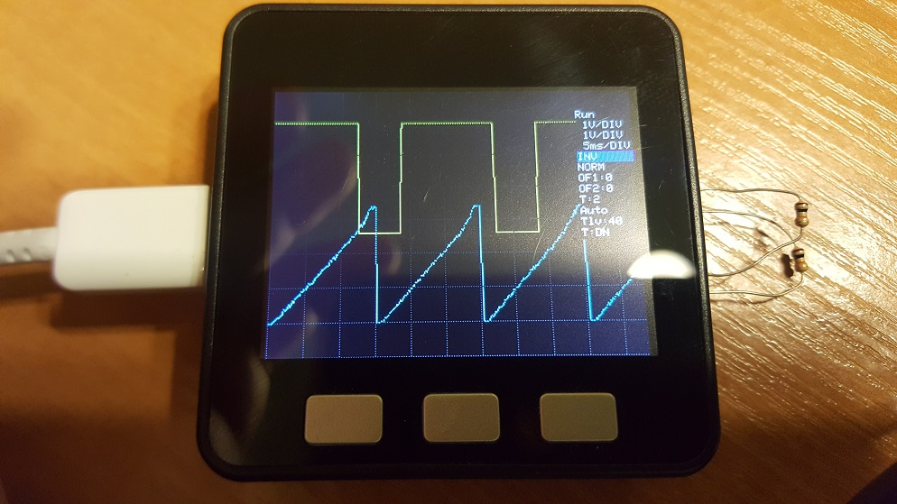

# M5Stack_Oscilloscope

## About
- Fully functional Dual Channel Oscilloscope running on M5Stack ESP32 development kit
- Channel 1 Input: Pin 35
- Channel 2 input: Pin 36

## Testing and callibration
- PWM signal Output: Pin 2
- SignaDelta Output: Pin 5

## Warning
#### ESP32 MAXIMUM GPIO input voltage is 3.3V
#### Feeding higher voltages on INPUT pin's can damage the chip
#### Consider using a voltage divider to measure higher voltage signals

### Oscilloscope Menu:
1. Run/Stop
2. Channel 1 range
3. Channel 2 range
4. Channel 1 and 2 rate
5. Channel 1 mode (Normal, Inverted, Off) 
6. Channel 2 mode (Normal, Inverted, Off) 
7. Channel 1 Offset
8. Channel 2 Offset
9. Trigger Channel: 1 or 2
10. Trigger mode Auto, Normal, Scan
11. Trigger Level
12. Trigger Edge: Rising (UP) or Falling (DN)

 
